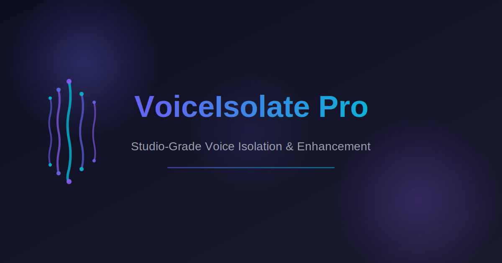

# VoiceIsolate Pro

**Studio-grade voice isolation and audio enhancement, running 100% in the browser.**

Upload any recording — a podcast, interview, call, voice-over, or video — and strip away every hiss, hum, room reflection and background voice, leaving your voice in pristine clarity. A twelve-stage professional DSP pipeline runs entirely client-side using the Web Audio API. **Nothing ever leaves your device.**



---

## ✨ Features

### Advanced DSP Processing Engine (Web Audio API)

- **Spectral Subtraction Noise Reduction** — classic STFT-based minimum-statistics noise profiling with over-subtraction and a spectral floor. Removes hiss, white / pink / brown noise, and environmental ambience.
- **5-Band Parametric EQ** — Low shelf (120 Hz) • Low-mid peak (400 Hz) • Mid peak (1.8 kHz) • Hi-mid peak (5 kHz) • High shelf (12 kHz).
- **Multiple Filter Types** — High-pass (20–500 Hz, adjustable), Low-pass, Band-pass, Notch (for electrical hum), Peaking, Low-shelf, High-shelf.
- **Electrical Hum Removal** — Auto-notch at 50 Hz or 60 Hz + six harmonics, Q = 30 for surgical removal.
- **Dynamic Range Compression** — Full threshold / ratio / attack / release / knee control, plus a brick-wall limiter stage.
- **Noise Gate** — Threshold, ratio, attack and release with Downward-expansion style gating around voice activity.
- **De-esser** — Narrow-Q attenuation around 7.2 kHz for sibilance control.
- **De-reverb** — Room-mode attenuation + mud cut to reduce reverb tails.
- **Voice Presence & Clarity** — 220 Hz warmth + 2 kHz presence + 5.8 kHz intelligibility + 11 kHz air boosts.
- **Volume Normalisation** — Peak-normalise to -0.3 dBFS for broadcast-ready output.
- **12-Stage Processing Pipeline** — All stages chained in an `OfflineAudioContext` for fast, deterministic offline processing.

### Professional User Interface

- **Drag-and-drop** audio/video upload zone supporting MP3, WAV, OGG, M4A, FLAC, MP4, MOV, MKV and WEBM up to 500 MB.
- **Real-time Canvas waveform** rendering for both the original and processed buffers, with scrub-to-seek.
- **Before/after A/B toggle** switches between the original and processed audio instantly.
- **Live DSP preview** on the original audio — tweak any slider and immediately hear the change.
- **Live spectrum analyser + dual-channel VU meter** powered by an `AnalyserNode`.
- **Ten curated presets** — Podcast, Music Vocal, Interview, Voice-Over, Audiobook, Broadcast, Zoom/Call, Streaming, ASMR, Neutral.
- **Save / load / delete custom presets** to `localStorage`.
- **Undo / redo** (50-step history).
- **Fully responsive** — works on desktop, tablet, and mobile.

### Export

- **WAV** export (16-bit or 24-bit PCM) — native, no extra dependencies.
- **MP3** export at 128/192/256/320 kbps via `lamejs` (dynamically imported).
- **Correct file extensions** — always `.wav` or `.mp3`.

---

## 🚀 Quick Start

```bash
cd nextjs_space
yarn install
yarn dev
# open http://localhost:3000
```

Build for production:

```bash
cd nextjs_space
yarn build
yarn start
```

Deploy to Vercel by importing the repository and pointing the root directory to `nextjs_space`.

---

## 🗺️ Architecture

```
nextjs_space/
├─ app/
│  ├─ layout.tsx        # Root layout, fonts, theme, OG metadata
│  ├─ page.tsx          # Landing / studio page (hero + Studio component)
│  └─ globals.css       # Studio dark theme + gradient orbs + range-slider polish
├─ components/
│  ├─ studio/
│  │  ├─ studio.tsx           # Main client-only studio orchestrator
│  │  ├─ controls-panel.tsx   # Collapsible control sections (core / EQ / dynamics / filters)
│  │  ├─ preset-grid.tsx      # 10 factory preset tiles
│  │  ├─ upload-zone.tsx      # Drag-and-drop uploader
│  │  ├─ waveform.tsx         # Canvas waveform with playhead
│  │  ├─ spectrum.tsx         # Live FFT spectrum bars
│  │  ├─ slider-field.tsx     # Labeled horizontal slider
│  │  └─ vu-meter.tsx         # Dual-channel VU meter with peak hold
│  └─ ui/ ...                 # shadcn components
├─ lib/
│  └─ dsp/
│     ├─ types.ts             # DSPSettings + factory presets
│     ├─ pipeline.ts          # buildDSPGraph(ctx, src, settings) + processBuffer()
│     ├─ spectral-denoise.ts  # STFT-based spectral subtraction
│     ├─ encoders.ts          # WAV + MP3 encoders + downloadBlob()
│     └─ media.ts             # File decoding + format utilities
└─ ...
```

The core DSP graph lives in `lib/dsp/pipeline.ts`. The `buildDSPGraph()` function is shared between **live preview** (runs on the real `AudioContext` during playback) and **offline rendering** (runs on an `OfflineAudioContext` when you press **Isolate & Enhance**). This keeps preview and export perfectly in sync.

---

## 📜 License

Copyright © 2026 Randy Jordan — All Rights Reserved.

See [LICENSE](./LICENSE) for the proprietary license terms.
