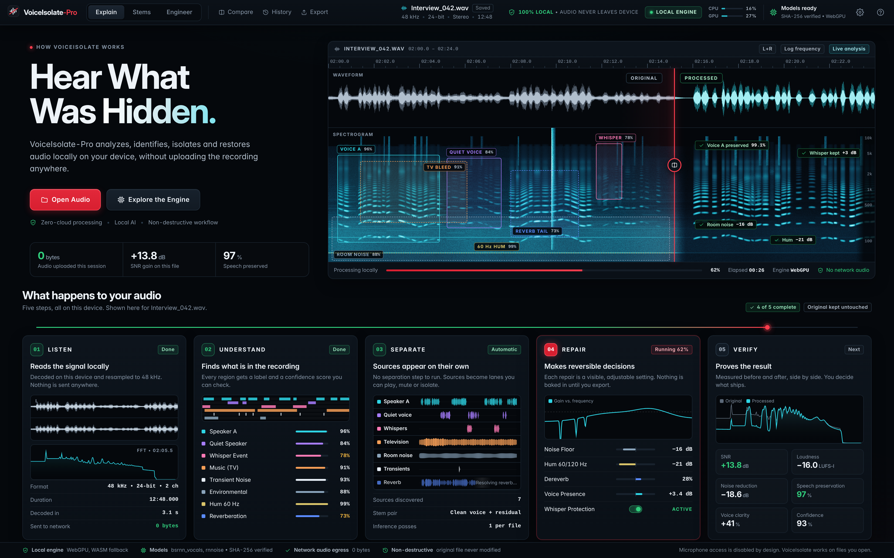
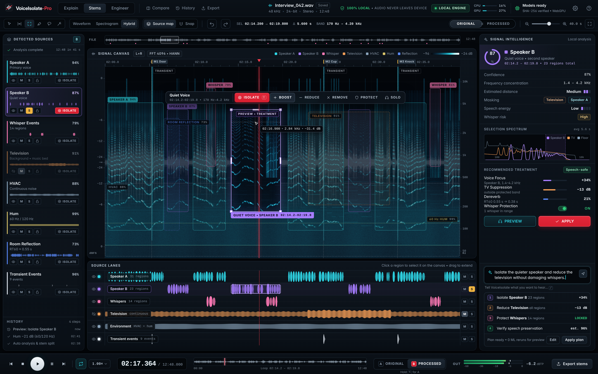
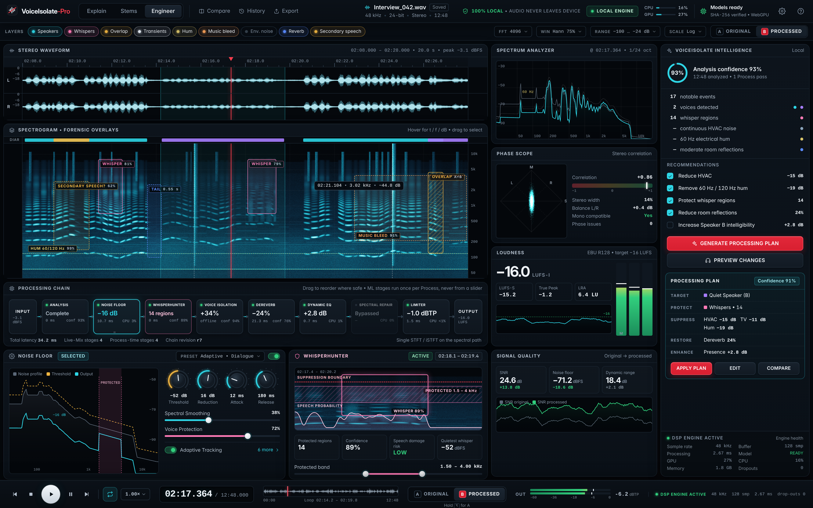

# VoiceIsolate-Pro UI mockups: Explain, Stems, Engineer

High-fidelity design direction for three connected surfaces. These are
**design mockups, not product code**. Nothing here is loaded by `public/` or `src/`.

| Page | File | Render |
|---|---|---|
| 01 Explain: how VoiceIsolate works | `explain.html` | `png/explain.png` |
| 02 Stems: interactive source isolation | `stems.html` | `png/stems.png` |
| 03 Engineer: audio engineering workstation | `engineer.html` | `png/engineer.png` |

PNGs are 3840x2400 (1920x1200 at 2x).





## How they are built

- `shell.css`: the shared shell (top bar, transport, panels, chips). Its color
  values mirror the Precision Studio tokens in `public/app/ds-tokens.css`; it
  does not import that file, so keep them in step by hand.
- `viz.js`: a deterministic signal model (seeded PRNG). One scene drives every view on a page:
  - voices with continuous pitch contours and formants
  - whispers
  - TV bleed
  - HVAC
  - 60/120 Hz hum
  - transients
  - a room tail
  
  The waveform, log-frequency spectrogram, source lanes, FFT curves and before/after
  spectra all come from that scene, so they agree with each other.
  The overlay boxes and tags are drawn by hand and label representative events.
  For example, the whisper at 02:18.1 sits inside the Speaker B selection on
  Stems and has no box of its own.
- No external scripts or fonts. Text uses system Inter and Liberation Mono.

## Re-render

```sh
docs/design/mockups/render.sh      # 2x (default)
docs/design/mockups/render.sh 1    # 1x
```

It launches Chromium with `--no-sandbox` and `--allow-file-access-from-files`.
Only run it on these trusted mockup files, or in an isolated container.

The script uses Chromium's `headless_shell` from `/opt/pw-browsers`. Override the
path with `VIP_HEADLESS_SHELL`. Do not use `chrome --headless=new` for
screenshots: it counts window chrome in `--window-size`, so the viewport comes
out about 87 px short and the bottom transport is cut off.

## Shipped vs. concept

The pages reorganize existing capabilities. They also show some concepts that are not built yet.

| Shown | Status |
|---|---|
| Stem split + Live-Mix, waveform/spectrogram, source lanes, A/B, export | Exists. Isolate, Boost and similar actions map to Live-Mix gains, not ML re-runs |
| WhisperHunter, dereverb, diarization lanes, LUFS, correlation | Exist in some form in `public/app` or `src/` |
| Models `bsrnn_vocals`, `rnnoise`, SHA-256 verified | Matches `ModelManifest.js` |
| Natural-language intent bar, "Estimated distance", per-region confidence on every source | **Concept only** |
| Draggable processing-chain reorder, plan generator | **Concept only** |

All numbers are illustrative. They include SNR +13.8 dB, 97% speech preservation and the
confidence values. They are not measurements of the shipped models. For measured quality,
see `docs/guides/AUDIO_QUALITY.md` and `pnpm test:quality`.
